# NexusSpec — 基于 Namespace 的分布式 Spec 系统设计

> **版本:** v0.3-draft
> **日期:** 2026-04-06
> **状态:** 设计草案
> **变更:**
> - v0.1 — 初始设计
> - v0.2 — Namespace 改为独立 Git 仓库；CLI 改为 OpenSpec wrapper 模式
> - v0.3 — Spec 结构改为树状模型；Namespace spec 为根节点；外部交互通过版本化契约

---

## 1. 背景与动机

### 1.1 问题陈述

在微服务架构中，一个业务变更往往涉及多个服务的协调修改。现有的 AI 编程工具（如 OpenSpec）擅长**单服务内部**的规范驱动开发，但缺乏**跨服务变更提案与协商**机制。当服务 A 需要服务 B 修改其 API 契约时，目前只能通过：

- 人工沟通（Slack/邮件）→ 容易遗漏、不可追溯
- 共享 monorepo → 强耦合、权限边界模糊
- API 网关层适配 → 治标不治本

### 1.2 设计目标

| 目标 | 描述 |
|------|------|
| **树状结构** | 整体 spec 呈现为树：Namespace spec 为根，各服务 spec 为子树 |
| **自治性** | 每个服务的 Agent 自主决定是否接受外部变更提案 |
| **版本化契约** | 与外部系统的交互通过带版本号的契约实现，支持渐进式演进 |
| **可追溯** | 所有跨服务提案、审批、拒绝都有完整记录 |
| **兼容性** | 单服务内部继续使用 OpenSpec 工作流，NexusSpec 作为 wrapper 透明集成 |
| **零侵入** | 不修改 OpenSpec 源码，通过包装模式扩展 |

---

## 2. 核心概念

### 2.1 树状 Spec 模型

整个 Namespace 的规范呈现为一棵**以 Namespace spec 为根、各服务 spec 为子树**的树：

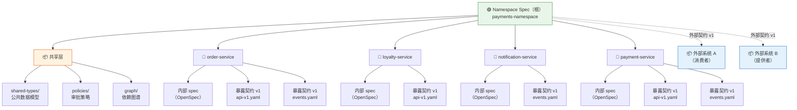

### 2.2 术语定义

| 术语 | 定义 |
|------|------|
| **Namespace Spec（根 spec）** | 树的根节点，定义命名空间级别的共享数据模型、策略、依赖图谱和外部契约 |
| **Service Spec（服务子树）** | 挂载在根节点下的子树，包含服务的内部 OpenSpec 规范 + 暴露的版本化契约 |
| **内部 spec** | 服务内部的 OpenSpec 规范（`openspec/specs/`），仅服务内部可见 |
| **暴露契约（Exposed Contract）** | 服务对外公开的 API/事件契约，带版本号，存储在 Namespace 仓库中，其他服务可引用 |
| **外部契约（External Contract）** | Namespace 与外部系统之间的版本化契约，定义跨命名空间的交互边界 |
| **Contract Ref** | 服务间引用契约的方式，格式 `contract://<service>/<type>/<name>:v<version>` |
| **Cross-Service Proposal（CSP）** | 一个服务向另一个服务发起的变更请求，涉及契约的版本演进 |
| **Wrapper 模式** | `nxsp` 命令封装 OpenSpec 的 `/opsx:*` 命令，在 OpenSpec 工作流基础上增加跨服务能力 |

### 2.3 树状结构的核心原则

| 原则 | 描述 |
|------|------|
| **根节点定义边界** | Namespace spec 定义"我们作为一个整体对外提供什么、对内共享什么" |
| **子树定义实现** | 每个 Service spec 定义"这个服务如何实现自己的职责" |
| **契约是连接边** | 服务间的依赖通过版本化契约表达，契约变更需要 CSP 流程 |
| **外部通过版本契约接入** | 外部系统不感知内部 spec 树，只通过特定版本的契约交互 |

---

## 3. 系统架构

### 3.1 双仓库模型

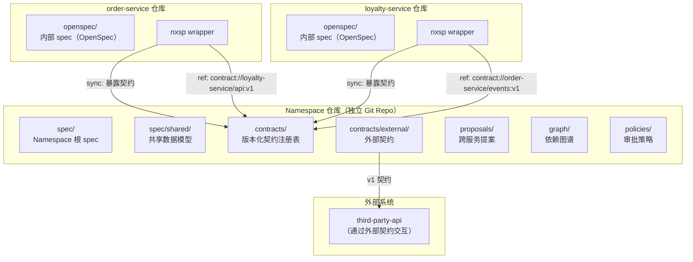

### 3.2 Namespace 仓库结构（树状布局）

```
payments-namespace/                      # 独立 Git 仓库
│
├── spec/                                 # 🟢 根 spec（Namespace 级别）
│   ├── namespace.md                      #   Namespace 概述、边界、SLA
│   ├── shared/                           #   📦 共享数据模型
│   │   ├── common-types.yaml             #     公共类型定义（OrderId, UserId, Money...）
│   │   ├── error-codes.yaml              #     统一错误码
│   │   └── auth-model.yaml               #     认证/授权模型
│   └── policies/                         #   Namespace 级别策略
│       ├── api-governance.md             #     API 治理规范
│       └── event-naming.md               #     事件命名规范
│
├── contracts/                            # 📋 版本化契约注册表
│   ├── order-service/                    #   order-service 暴露的契约
│   │   ├── api/
│   │   │   ├── v1.yaml                   #     API 契约 v1（当前）
│   │   │   └── v2.yaml                   #     API 契约 v2（草案/已废弃）
│   │   └── events/
│   │       ├── v1.yaml                   #     事件契约 v1
│   │       └── v2.yaml                   #     事件契约 v2（草案）
│   │
│   ├── loyalty-service/
│   │   └── api/
│   │       └── v1.yaml
│   │
│   ├── notification-service/
│   │   └── events/
│   │       └── v1.yaml
│   │
│   └── external/                         #   📦 外部契约（与外部系统的交互）
│       ├── payment-gateway/
│       │   └── api/
│       │       ├── v1.yaml               #     第三方支付网关 API v1
│       │       └── v2.yaml               #     第三方支付网关 API v2
│       └── sms-provider/
│           └── api/
│               └── v1.yaml
│
├── proposals/                            # 跨服务提案
│   ├── active/
│   │   ├── CSP-001-add-loyalty-points/
│   │   │   ├── proposal.yaml
│   │   │   ├── proposal.md
│   │   │   ├── spec-delta.md
│   │   │   ├── impact-analysis.md
│   │   │   └── review/
│   │   └── CSP-002-payment-gateway-v2/
│   │       └── ...
│   └── archive/
│       └── ...
│
├── graph/                                # 依赖图谱
│   ├── schema.yaml
│   └── snapshot.json
│
└── config.yaml                           # Namespace 配置
```

### 3.3 单服务仓库结构（零侵入）

```
order-service/                           # 服务独立 Git 仓库
├── openspec/                            # 标准 OpenSpec（完全不变）
│   ├── config.yaml
│   ├── changes/
│   └── specs/
│       └── ...
│
├── .nxsp/
│   └── config.yaml                      # 服务注册 + Namespace 地址 + 契约来源
│
└── ...
```

---

## 4. 版本化契约

### 4.1 契约版本模型

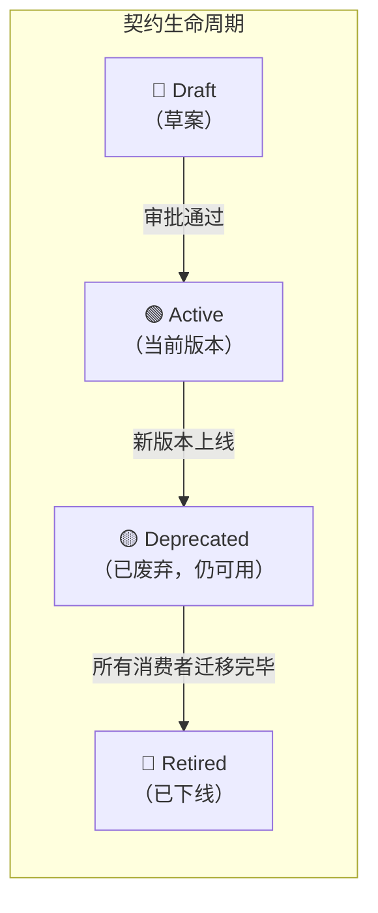

**版本规则：**
- 每个契约类型（api / events）独立版本号
- 同一时刻最多一个 `Active` 版本
- `Deprecated` 版本仍可使用，但会触发迁移警告
- `Retired` 版本不可用，引用它的服务会收到编译/运行时错误
- 版本号格式：`v1`, `v2`, `v3`...（整数递增，不支持语义化版本号的子版本）

### 4.2 Contract Ref（契约引用）

服务间通过 **Contract Ref** 引用其他服务的契约：

```
contract://<service>/<type>/<name>:v<version>
```

**示例：**

```yaml
# order-service 引用 loyalty-service 的 API 契约
dependencies:
  loyalty_api: contract://loyalty-service/api/default:v1

# order-service 引用 notification-service 的事件契约
dependencies:
  notification_events: contract://notification-service/events/default:v1

# order-service 引用外部支付网关的 API 契约
dependencies:
  payment_gateway: contract://external/payment-gateway/api/default:v1
```

### 4.3 契约变更与 CSP 的关系

契约版本升级**必须**通过 CSP 流程：

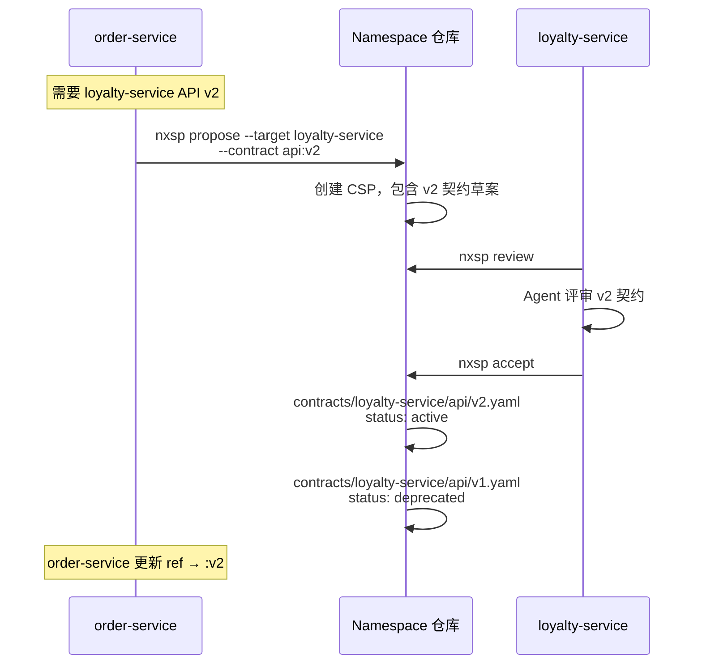

### 4.4 外部契约管理

与 Namespace 外部系统的交互通过 `contracts/external/` 管理：

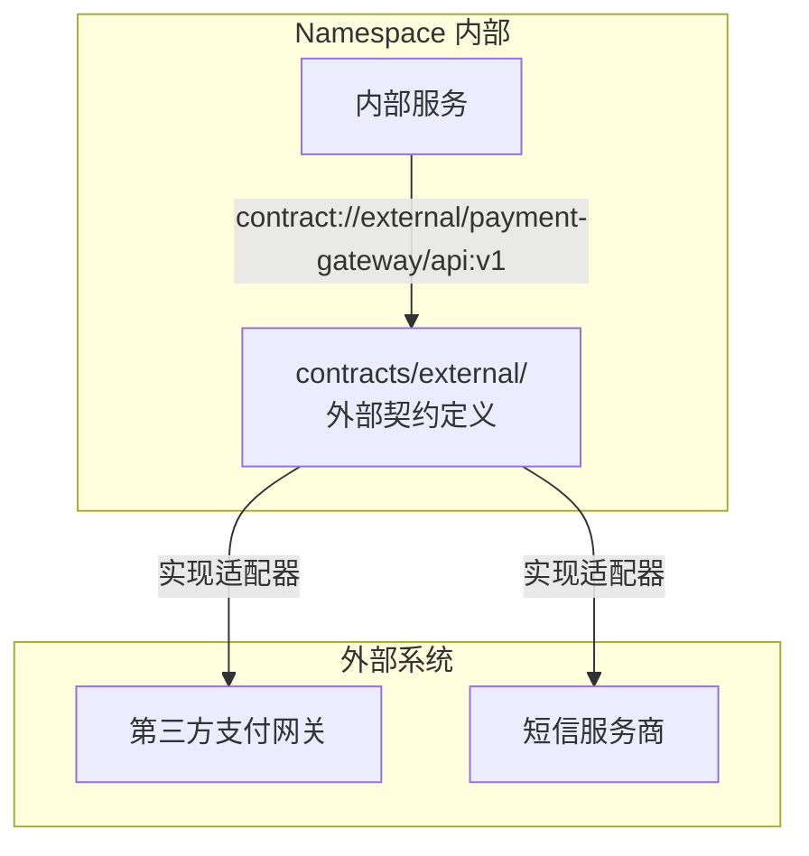

**外部契约变更流程：**

| 场景 | 流程 |
|------|------|
| 外部系统发布新版本 | 在 `contracts/external/` 中添加新版本草案 → 创建 CSP 评估影响 → 各服务迁移 |
| 外部系统废弃旧版本 | 标记旧版本为 deprecated → 创建 CSP 追踪迁移进度 → 全部迁移后标记 retired |
| 新增外部系统依赖 | 在 `contracts/external/` 中添加契约 → 关联到引用它的服务 |

---

## 5. 树状 Spec 的展开视图

### 5.1 完整树状展开

```mermaid
graph TD
    ROOT["payments-namespace"]

    ROOT --> S1["spec/namespace.md<br/>─────────────────<br/>• Namespace 边界定义<br/>• 全局 SLA（99.9%）<br/>• 认证模型（JWT + mTLS）<br/>• 事件总线（Kafka）"]

    ROOT --> S2["spec/shared/common-types.yaml<br/>─────────────────<br/>• OrderId: string (UUID v4)<br/>• UserId: string (UUID v4)<br/>• Money: { amount: int, currency: string }<br/>• Timestamp: ISO 8601"]

    ROOT --> S3["spec/shared/error-codes.yaml<br/>─────────────────<br/>• PAYMENT_REQUIRED: 1001<br/>• INSUFFICIENT_STOCK: 2001<br/>• RATE_LIMITED: 3001"]

    ROOT --> C1["contracts/order-service/api/v1.yaml<br/>─────────────────<br/>• POST /orders<br/>• GET /orders/{id}<br/>• PATCH /orders/{id}/status"]

    ROOT --> C2["contracts/order-service/events/v1.yaml<br/>─────────────────<br/>• order.created<br/>• order.completed<br/>• order.cancelled"]

    ROOT --> C3["contracts/loyalty-service/api/v1.yaml<br/>─────────────────<br/>• GET /points/balance<br/>• POST /points/credit"]

    ROOT --> C4["contracts/notification-service/events/v1.yaml<br/>─────────────────<br/>• notification.sent<br/>• notification.read"]

    ROOT --> C5["contracts/external/payment-gateway/api/v1.yaml<br/>─────────────────<br/>• POST /charge<br/>• POST /refund"]

    style ROOT fill:#e8f5e9,stroke:#2e7d32,stroke-width:2px
    style S1 fill:#f1f8e9,stroke:#558b2f
    style S2 fill:#f1f8e9,stroke:#558b2f
    style S3 fill:#f1f8e9,stroke:#558b2f
    style C1 fill:#fff3e0,stroke:#e65100
    style C2 fill:#fff3e0,stroke:#e65100
    style C3 fill:#fff3e0,stroke:#e65100
    style C4 fill:#fff3e0,stroke:#e65100
    style C5 fill:#e3f2fd,stroke:#1565c0
```

### 5.2 树状结构的三层视图

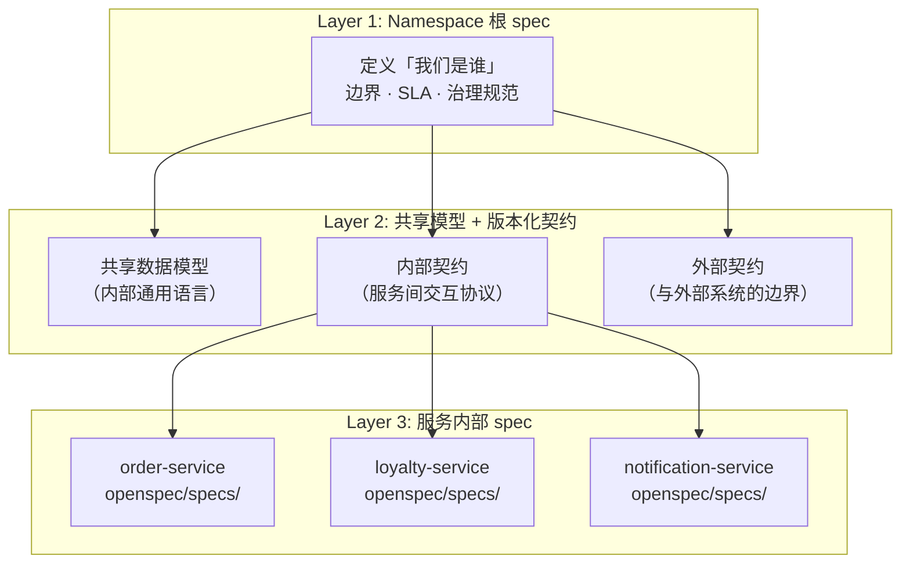

---

## 6. Wrapper 模式：nxsp 对 OpenSpec 的封装

### 6.1 命令映射关系

| nxsp 命令 | 委托的 OpenSpec 命令 | nxsp 增加的逻辑 |
|-----------|---------------------|----------------|
| `nxsp propose` | `/opsx:new` + `/opsx:ff`（发起方本地） | 创建 CSP + 契约版本草案 → git push |
| `nxsp accept <id>` | `/opsx:new` + `/opsx:ff`（受理方本地） | 拉取提案 → 注入文件 → 激活契约版本 → git push |
| `nxsp apply` | `/opsx:apply` | 无额外逻辑，直接透传 |
| `nxsp archive` | `/opsx:archive` | 归档后自动 sync-contracts + 更新契约版本状态 |
| `nxsp sync` | `/opsx:sync` | 同步后检测契约变更 → 更新 Contract Registry |
| `nxsp review` | 无 | 拉取待评审提案 → 交付 Agent 评审 |
| `nxsp reject` | 无 | 更新提案状态 |
| `nxsp counter` | 无 | 创建反提案 |
| `nxsp sync-contracts` | 无 | 提取本地契约 → git push |
| `nxsp contract promote <name> --version v2` | 无 | 将契约草案提升为 active，旧版本降级为 deprecated |
| `nxsp contract retire <name> --version v1` | 无 | 将契约标记为 retired |
| `nxsp impact` | 无 | 基于依赖图谱 + 契约引用分析影响范围 |
| `nxsp tree` | 无 | 展示当前 Namespace 的 spec 树状结构 |

### 6.2 安装与配置

```bash
npm install -g @nexus-spec/cli
npm install -g @fission-ai/openspec

cd order-service/
nxsp init --namespace git@github.com:org/payments-namespace.git
```

**`.nxsp/config.yaml`：**

```yaml
service:
  name: order-service
  team: payments-team

namespace:
  remote: git@github.com:org/payments-namespace.git
  local_path: ~/.nxsp/namespaces/payments-namespace

# 本服务暴露的契约（同步到 Namespace）
exposes:
  - type: api
    path: "src/api/openapi.yaml"
    name: default
  - type: events
    path: "src/events/schemas/"
    name: default

# 本服务依赖的契约（从 Namespace 引用）
depends:
  loyalty_api: contract://loyalty-service/api/default:v1
  notification_events: contract://notification-service/events/default:v1
  payment_gateway: contract://external/payment-gateway/api/default:v1

# 引用的共享模型
shared_types:
  - common-types
  - error-codes
```

---

## 7. 跨服务变更提案（CSP）协议

### 7.1 提案生命周期

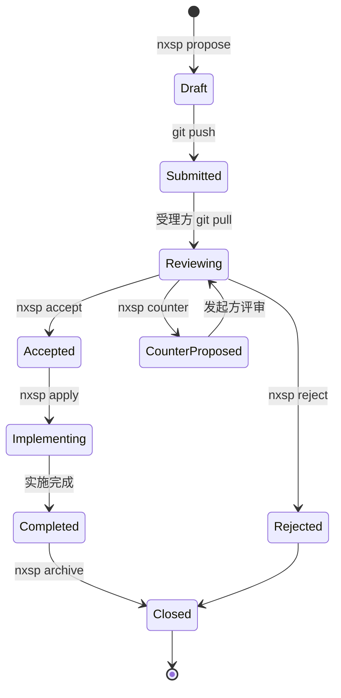

### 7.2 提案元数据（含契约版本信息）

```yaml
id: CSP-001
title: "Add Loyalty Points to Order Flow"
status: submitted

initiator:
  service: order-service
  agent: claude-code
  created_at: "2026-04-06T10:00:00Z"

targets:
  - service: loyalty-service
    required_action: new_contract_version
    contract:
      type: api
      name: default
      current_version: v1
      proposed_version: v2
      change: add_endpoint
      detail: "POST /api/v2/points/credit"
    urgency: normal
    review_status: pending

contract_refs:
  # 本提案涉及的契约引用变更
  - ref: contract://loyalty-service/api/default:v2
    action: upgrade_from_v1
  - ref: contract://order-service/events/default:v1
    action: add_event
    event: order.points_credited

breaking: false
backward_compatible: true
```

### 7.3 Spec Delta（OpenSpec 原生格式）

```markdown
## ADDED Requirements

### Requirement: Loyalty Service exposes credit endpoint v2
The Loyalty Service SHALL expose a POST /api/v2/points/credit endpoint.

#### Scenario: Successful points credit
- **WHEN** Order Service sends POST /api/v2/points/credit
- **THEN** Loyalty Service responds with 201 Created
- **AND** response contains { transactionId, points, newBalance }

#### Scenario: Idempotent credit
- **WHEN** same transactionId is sent twice
- **THEN** returns 200 OK with existing transaction
```

---

## 8. Agent 评审机制

### 8.1 评审决策框架

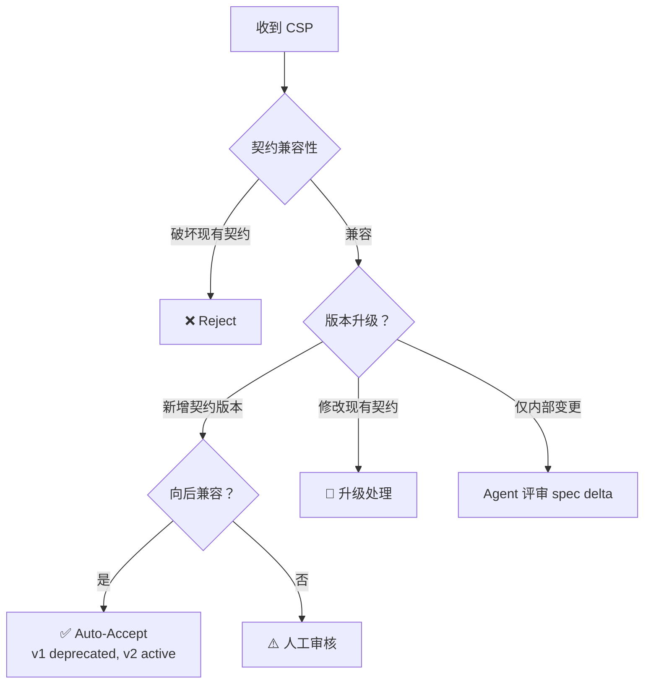

### 8.2 评审策略

```yaml
# policies/proposal-policy.yaml
auto_accept:
  rules:
    - match:
        contract_action: new_contract_version
        backward_compatible: true
      action: auto_accept
      # 自动执行: v_new → active, v_old → deprecated

    - match:
        contract_action: modify_contract
        backward_compatible: false
      action: require_human_approval
      approvers: [platform-team]

    - match:
        contract_action: [add_event, add_endpoint]
      action: auto_accept_with_review
```

---

## 9. 依赖图谱

### 9.1 基于契约引用的依赖图

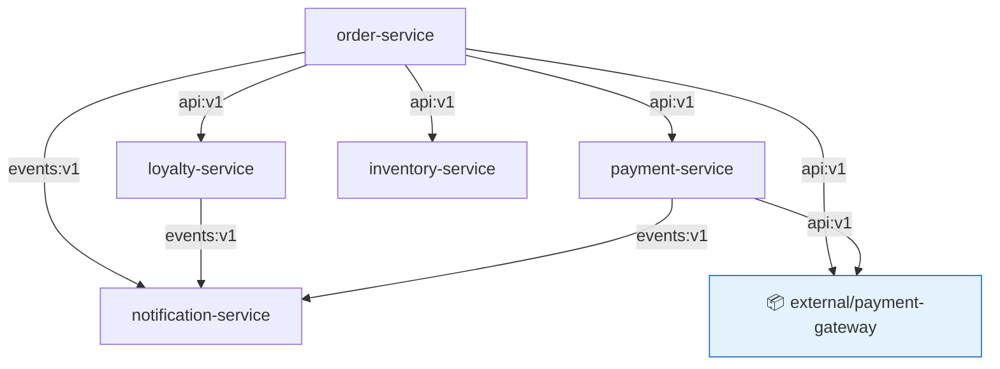

### 9.2 契约影响分析

当某个契约版本变更时，系统自动追踪所有引用该契约的服务：

```yaml
# nxsp impact --contract loyalty-service/api:v1→v2
direct_impact:
  - order-service: references contract://loyalty-service/api/default:v1
    action: update_ref_to_v2

downstream_impact:
  - notification-service: consumes order.points_credited event (new in v2)
    action: optional_adapt

contract_version_transition:
  from: v1 (active → deprecated)
  to: v2 (draft → active)
```

---

## 10. 数据流全景

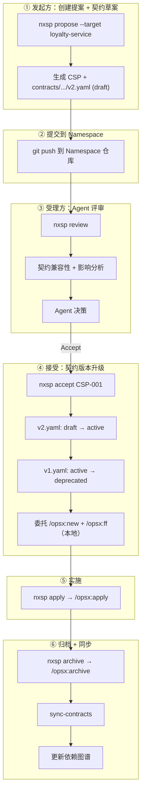

---

## 11. 实施路线图

### Phase 1: MVP

| 任务 | 描述 | 优先级 |
|------|------|--------|
| `nxsp` CLI 骨架 | 全局安装、命令路由、OpenSpec wrapper | P0 |
| Namespace 仓库初始化 | 树状目录结构、根 spec、共享模型 | P0 |
| 契约版本管理 | `contracts/<service>/<type>/v<n>.yaml` 结构 | P0 |
| 提案创建与评审 | `nxsp propose/review/accept/reject` | P0 |
| 契约同步 | `nxsp sync-contracts` | P0 |

### Phase 2: 智能化

| 任务 | 描述 | 优先级 |
|------|------|--------|
| Contract Ref 解析 | 解析 `contract://` 引用，构建依赖图 | P1 |
| 契约版本生命周期 | promote / deprecate / retire | P1 |
| 影响分析 | 基于契约引用的下游影响追踪 | P1 |
| 策略引擎 | 自动 Accept/Reject/Escalate | P1 |
| 外部契约管理 | `contracts/external/` + 适配器生成 | P1 |

### Phase 3: 生态完善

| 任务 | 描述 | 优先级 |
|------|------|--------|
| `nxsp tree` | 树状 spec 可视化 | P2 |
| MCP Server | 暴露工具给 AI Agent | P2 |
| GitNexus 集成 | 知识图谱增强 | P2 |
| Webhook 通知 | 提案/契约状态变更通知 | P2 |

---

## 12. 关键设计决策

| 决策 | 选择 | 理由 |
|------|------|------|
| **Spec 结构** | 树状模型 | 层次清晰：根定义边界，子树定义实现，契约定义交互 |
| **Namespace 存储** | 独立 Git 仓库 | 权限独立、版本控制、服务仓库保持纯净 |
| **CLI 架构** | Wrapper 模式 | 零侵入 OpenSpec，升级时自动受益 |
| **契约版本** | 整数递进（v1, v2...） | 简单明确，避免语义化版本号的复杂性 |
| **契约引用** | `contract://` URI | 可机器解析，支持依赖图谱自动构建 |
| **外部交互** | `contracts/external/` | 与内部契约统一管理，版本化演进 |
| **通信方式** | Git push/pull | 无运行时依赖、离线可用、天然审计 |
