# NexusSpec 详细设计文档

## 文档信息

| 项目 | 内容 |
|------|------|
| 版本 | 2.0.0 |
| 创建日期 | 2026-04-29 |
| 最后更新 | 2026-04-29 |
| 作者 | NexusSpec Team |

---

## 目录

1. [概述](#1-概述)
2. [系统架构设计](#2-系统架构设计)
3. [核心模块详细设计](#3-核心模块详细设计)
4. [数据模型设计](#4-数据模型设计)
5. [CLI 命令设计](#5-cli-命令设计)
6. [工作流程设计](#6-工作流程设计)
7. [性能与可靠性设计](#7-性能与可靠性设计)
8. [UI 组件设计](#8-ui-组件设计)
9. [扩展机制](#9-扩展机制)

---

## 1. 概述

### 1.1 项目背景

NexusSpec 是一个分布式规范系统，提供跨服务的规范协调和契约管理能力。它深度集成 OpenSpec 1.3，通过 CSP (Cross-Service Proposal) 机制实现服务间的协调变更。

### 1.2 核心特性

- **深度 OpenSpec 集成** - 直接集成 OpenSpec 1.3 的 OPSX 工作流
- **命名空间管理** - 树状规范系统与共享契约
- **跨服务提案 (CSP)** - 协调多服务的变更机制
- **契约版本管理** - 完整的契约生命周期管理
- **智能审查引擎** - AI 辅助的提案审查
- **CI/CD 集成** - 自动化契约验证与部署

### 1.3 技术栈

| 层级 | 技术选型 |
|------|----------|
| 运行时 | Node.js 20.19.0+ |
| 语言 | TypeScript 5.9 |
| CLI 框架 | Commander.js 14 |
| 配置解析 | YAML (yaml 库) |
| 数据验证 | Zod 4 |
| UI 框架 | React 19 + Vite 6 |
| 可视化 | ReactFlow 11 |
| 样式 | TailwindCSS 3 |

---

## 2. 系统架构设计

### 2.1 整体架构

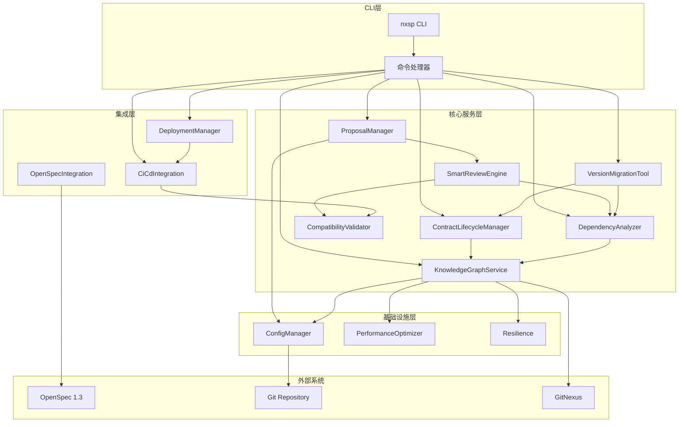
```mermaid
graph TB
    subgraph CLI层
        CLI[nxsp CLI]
        Commands[命令处理器]
    end
    
    subgraph 核心服务层
        PM[ProposalManager]
        CLM[ContractLifecycleManager]
        VMT[VersionMigrationTool]
        DA[DependencyAnalyzer]
        KG[KnowledgeGraphService]
        SRE[SmartReviewEngine]
        CV[CompatibilityValidator]
    end
    
    subgraph 集成层
        OSI[OpenSpecIntegration]
        CICD[CiCdIntegration]
        DM[DeploymentManager]
    end
    
    subgraph 基础设施层
        CM[ConfigManager]
        PO[PerformanceOptimizer]
        RS[Resilience]
    end
    
    subgraph 外部系统
        OS[OpenSpec 1.3]
        Git[Git Repository]
        GN[GitNexus]
    end
    
    CLI --> Commands
    Commands --> PM
    Commands --> CLM
    Commands --> VMT
    Commands --> DA
    Commands --> KG
    Commands --> CICD
    Commands --> DM
    
    PM --> SRE
    PM --> CM
    SRE --> DA
    SRE --> CV
    
    CLM --> KG
    VMT --> CLM
    VMT --> DA
    
    DA --> KG
    KG --> CM
    KG --> PO
    KG --> RS
    
    OSI --> OS
    CICD --> CV
    DM --> CICD
    
    CM --> Git
    KG --> GN
```

### 2.2 双仓库模型

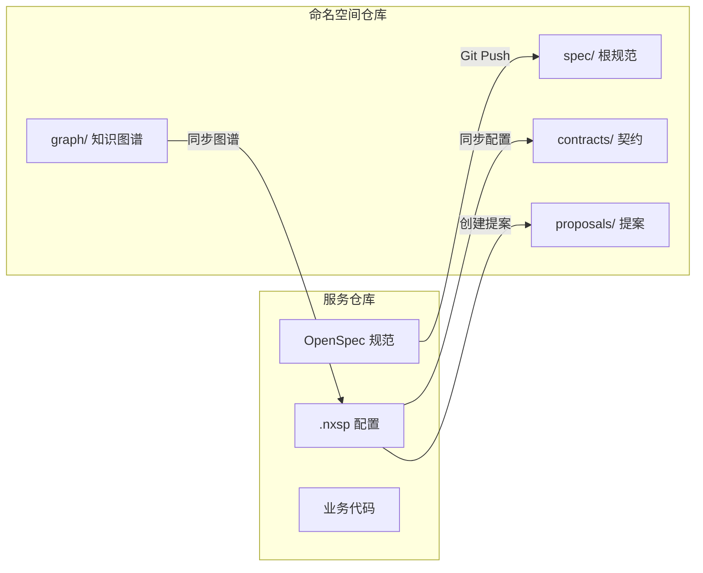
```mermaid
graph LR
    subgraph 服务仓库
        SR1[OpenSpec 规范]
        SR2[.nxsp 配置]
        SR3[业务代码]
    end
    
    subgraph 命名空间仓库
        NR1[spec/ 根规范]
        NR2[contracts/ 契约]
        NR3[proposals/ 提案]
        NR4[graph/ 知识图谱]
    end
    
    SR1 -->|Git Push| NR1
    SR2 -->|同步配置| NR2
    SR2 -->|创建提案| NR3
    NR4 -->|同步图谱| SR2
```

### 2.3 目录结构

**命名空间仓库结构:**

```
namespace/
├── spec/
│   ├── namespace.md
│   ├── shared/
│   │   ├── common-types.yaml
│   │   └── error-codes.yaml
│   └── policies/
├── contracts/
│   ├── service-a/
│   │   ├── api/
│   │   │   ├── v1.yaml
│   │   │   └── default-metadata.yaml
│   │   └── events/
│   ├── service-b/
│   └── external/
├── proposals/
│   ├── active/
│   │   └── CSP-XXX/
│   │       ├── proposal.yaml
│   │       ├── proposal.md
│   │       └── review-result.yaml
│   └── archive/
├── graph/
│   └── knowledge-graph.json
└── config.yaml
```

**服务仓库结构:**

```
service/
├── openspec/
│   ├── config.yaml
│   ├── changes/
│   └── specs/
├── .nxsp/
│   └── config.yaml
└── [业务代码]
```

---

## 3. 核心模块详细设计

### 3.1 配置管理器 (ConfigManager)

**职责:** 管理服务配置的加载、保存和验证

**类图:**

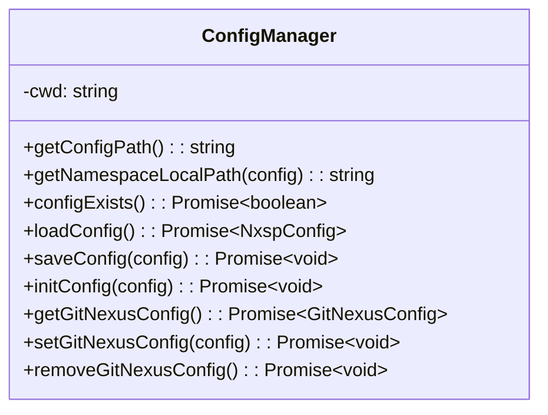
```mermaid
classDiagram
    class ConfigManager {
        -cwd: string
        +getConfigPath(): string
        +getNamespaceLocalPath(config): string
        +configExists(): Promise~boolean~
        +loadConfig(): Promise~NxspConfig~
        +saveConfig(config): Promise~void~
        +initConfig(config): Promise~void~
        +getGitNexusConfig(): Promise~GitNexusConfig~
        +setGitNexusConfig(config): Promise~void~
        +removeGitNexusConfig(): Promise~void~
    }
```

**配置数据结构:**

```typescript
interface NxspConfig {
  service: {
    name: string;
    team?: string;
  };
  namespace: {
    remote: string;
    localPath?: string;
  };
  exposes: Array<{
    type: 'api' | 'events';
    path: string;
    name: string;
  }>;
  depends: Record<string, string>;
  sharedTypes?: string[];
  gitnexus?: GitNexusConfig;
  cicd?: CiCdConfig;
}
```

### 3.2 提案管理器 (ProposalManager)

**职责:** 管理跨服务提案的完整生命周期

**类图:**

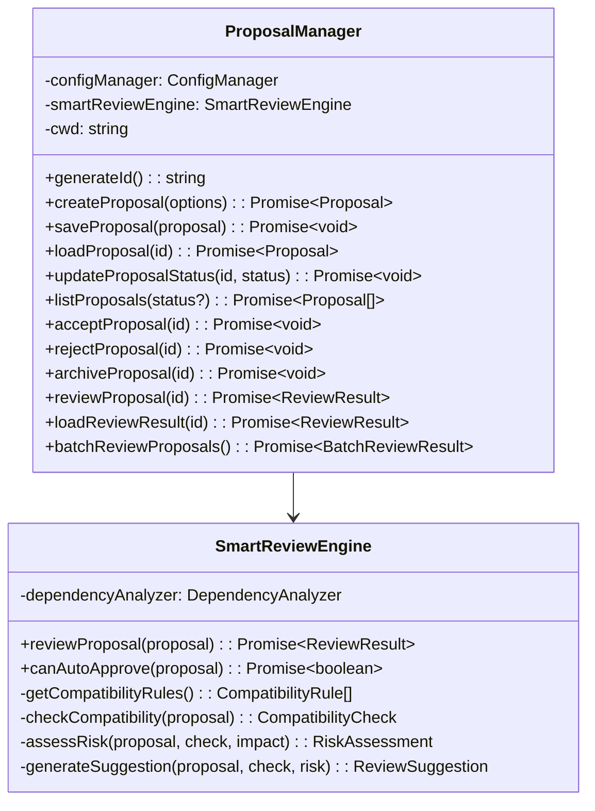
```mermaid
classDiagram
    class ProposalManager {
        -configManager: ConfigManager
        -smartReviewEngine: SmartReviewEngine
        -cwd: string
        +generateId(): string
        +createProposal(options): Promise~Proposal~
        +saveProposal(proposal): Promise~void~
        +loadProposal(id): Promise~Proposal~
        +updateProposalStatus(id, status): Promise~void~
        +listProposals(status?): Promise~Proposal[]~
        +acceptProposal(id): Promise~void~
        +rejectProposal(id): Promise~void~
        +archiveProposal(id): Promise~void~
        +reviewProposal(id): Promise~ReviewResult~
        +loadReviewResult(id): Promise~ReviewResult~
        +batchReviewProposals(): Promise~BatchReviewResult~
    }
    
    class SmartReviewEngine {
        -dependencyAnalyzer: DependencyAnalyzer
        +reviewProposal(proposal): Promise~ReviewResult~
        +canAutoApprove(proposal): Promise~boolean~
        -getCompatibilityRules(): CompatibilityRule[]
        -checkCompatibility(proposal): CompatibilityCheck
        -assessRisk(proposal, check, impact): RiskAssessment
        -generateSuggestion(proposal, check, risk): ReviewSuggestion
    }
    
    ProposalManager --> SmartReviewEngine
```

**提案状态流转:**

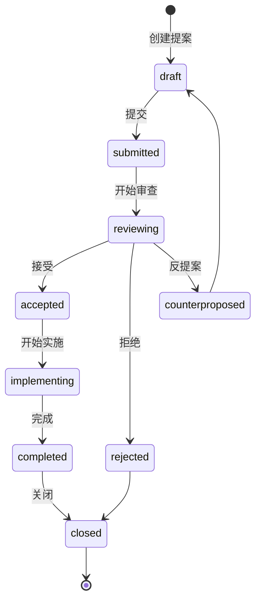
```mermaid
stateDiagram-v2
    [*] --> draft: 创建提案
    draft --> submitted: 提交
    submitted --> reviewing: 开始审查
    reviewing --> accepted: 接受
    reviewing --> rejected: 拒绝
    reviewing --> counterproposed: 反提案
    accepted --> implementing: 开始实施
    implementing --> completed: 完成
    completed --> closed: 关闭
    rejected --> closed
    counterproposed --> draft
    closed --> [*]
```

### 3.3 契约生命周期管理器 (ContractLifecycleManager)

**职责:** 管理契约版本的完整生命周期

**类图:**

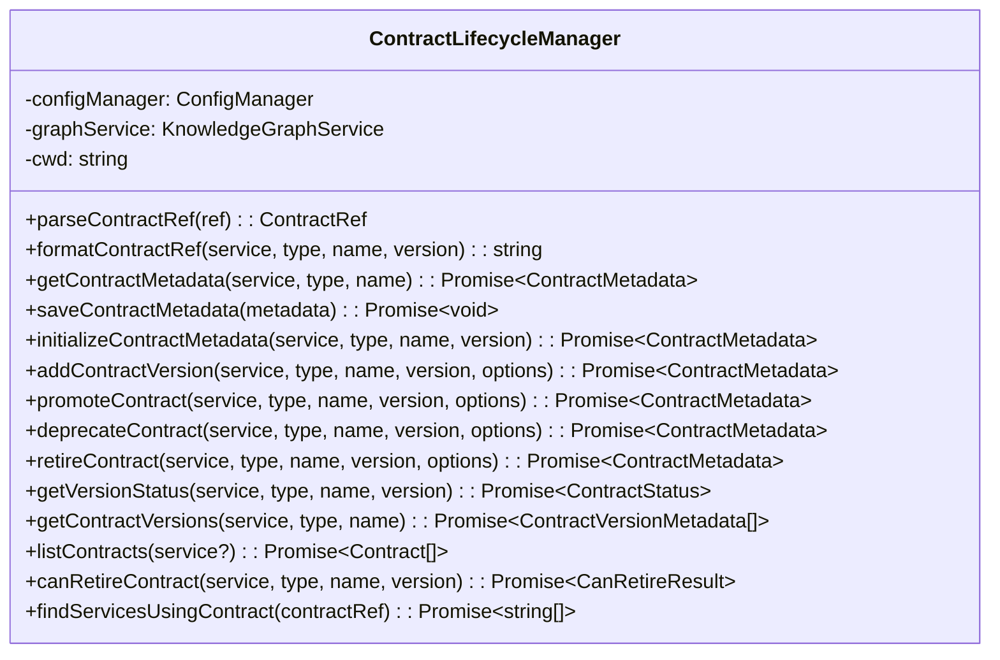
```mermaid
classDiagram
    class ContractLifecycleManager {
        -configManager: ConfigManager
        -graphService: KnowledgeGraphService
        -cwd: string
        +parseContractRef(ref): ContractRef
        +formatContractRef(service, type, name, version): string
        +getContractMetadata(service, type, name): Promise~ContractMetadata~
        +saveContractMetadata(metadata): Promise~void~
        +initializeContractMetadata(service, type, name, version): Promise~ContractMetadata~
        +addContractVersion(service, type, name, version, options): Promise~ContractMetadata~
        +promoteContract(service, type, name, version, options): Promise~ContractMetadata~
        +deprecateContract(service, type, name, version, options): Promise~ContractMetadata~
        +retireContract(service, type, name, version, options): Promise~ContractMetadata~
        +getVersionStatus(service, type, name, version): Promise~ContractStatus~
        +getContractVersions(service, type, name): Promise~ContractVersionMetadata[]~
        +listContracts(service?): Promise~Contract[]~
        +canRetireContract(service, type, name, version): Promise~CanRetireResult~
        +findServicesUsingContract(contractRef): Promise~string[]~
    }
```

**契约版本状态:**

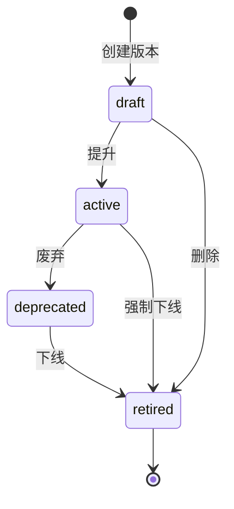
```mermaid
stateDiagram-v2
    [*] --> draft: 创建版本
    draft --> active: 提升
    active --> deprecated: 废弃
    deprecated --> retired: 下线
    active --> retired: 强制下线
    draft --> retired: 删除
    retired --> [*]
```

### 3.4 版本迁移工具 (VersionMigrationTool)

**职责:** 处理契约版本迁移的复杂逻辑

**类图:**

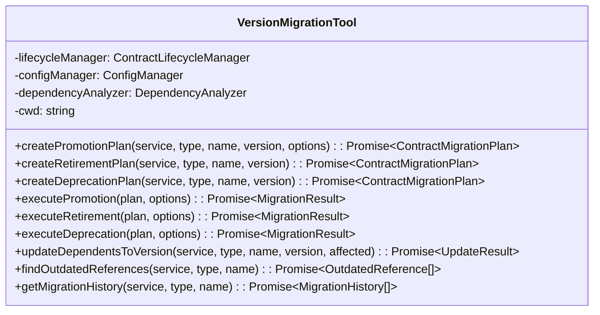
```mermaid
classDiagram
    class VersionMigrationTool {
        -lifecycleManager: ContractLifecycleManager
        -configManager: ConfigManager
        -dependencyAnalyzer: DependencyAnalyzer
        -cwd: string
        +createPromotionPlan(service, type, name, version, options): Promise~ContractMigrationPlan~
        +createRetirementPlan(service, type, name, version): Promise~ContractMigrationPlan~
        +createDeprecationPlan(service, type, name, version): Promise~ContractMigrationPlan~
        +executePromotion(plan, options): Promise~MigrationResult~
        +executeRetirement(plan, options): Promise~MigrationResult~
        +executeDeprecation(plan, options): Promise~MigrationResult~
        +updateDependentsToVersion(service, type, name, version, affected): Promise~UpdateResult~
        +findOutdatedReferences(service, type, name): Promise~OutdatedReference[]~
        +getMigrationHistory(service, type, name): Promise~MigrationHistory[]~
    }
```

**迁移计划结构:**

```typescript
interface ContractMigrationPlan {
  contractRef: string;
  fromVersion: string;
  toVersion: string;
  fromStatus: ContractStatus;
  toStatus: ContractStatus;
  affectedServices: string[];
  migrationSteps: MigrationStep[];
  riskLevel: 'low' | 'medium' | 'high' | 'critical';
  requiresManualReview: boolean;
  migrationType: 'promote' | 'retire' | 'deprecate';
}
```

### 3.5 依赖分析器 (DependencyAnalyzer)

**职责:** 分析服务间的依赖关系和变更影响

**类图:**

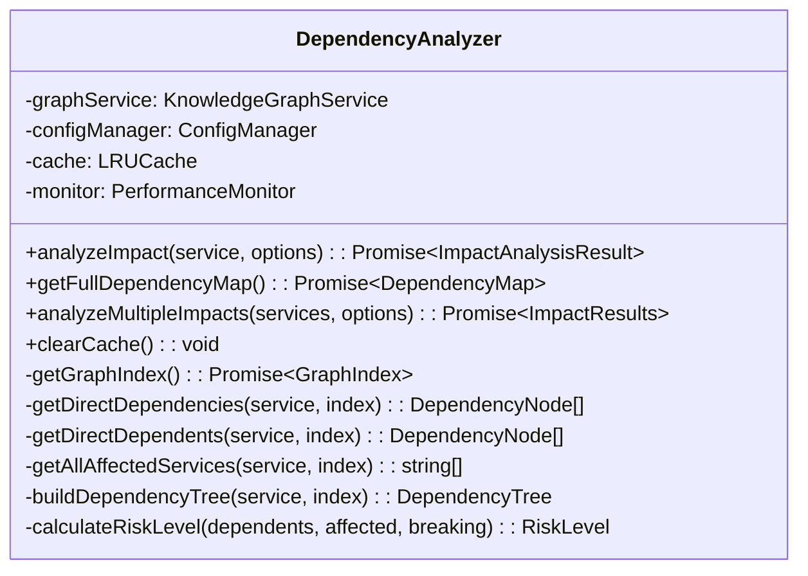
```mermaid
classDiagram
    class DependencyAnalyzer {
        -graphService: KnowledgeGraphService
        -configManager: ConfigManager
        -cache: LRUCache
        -monitor: PerformanceMonitor
        +analyzeImpact(service, options): Promise~ImpactAnalysisResult~
        +getFullDependencyMap(): Promise~DependencyMap~
        +analyzeMultipleImpacts(services, options): Promise~ImpactResults~
        +clearCache(): void
        -getGraphIndex(): Promise~GraphIndex~
        -getDirectDependencies(service, index): DependencyNode[]
        -getDirectDependents(service, index): DependencyNode[]
        -getAllAffectedServices(service, index): string[]
        -buildDependencyTree(service, index): DependencyTree
        -calculateRiskLevel(dependents, affected, breaking): RiskLevel
    }
```

**影响分析结果:**

```typescript
interface ImpactAnalysisResult {
  targetService: string;
  directDependencies: DependencyNode[];
  directDependents: DependencyNode[];
  allAffectedServices: string[];
  dependencyTree: DependencyTree;
  riskLevel: 'low' | 'medium' | 'high' | 'critical';
  summary: string;
}
```

### 3.6 知识图谱服务 (KnowledgeGraphService)

**职责:** 管理服务间的知识图谱，支持依赖追踪和影响分析

**类图:**

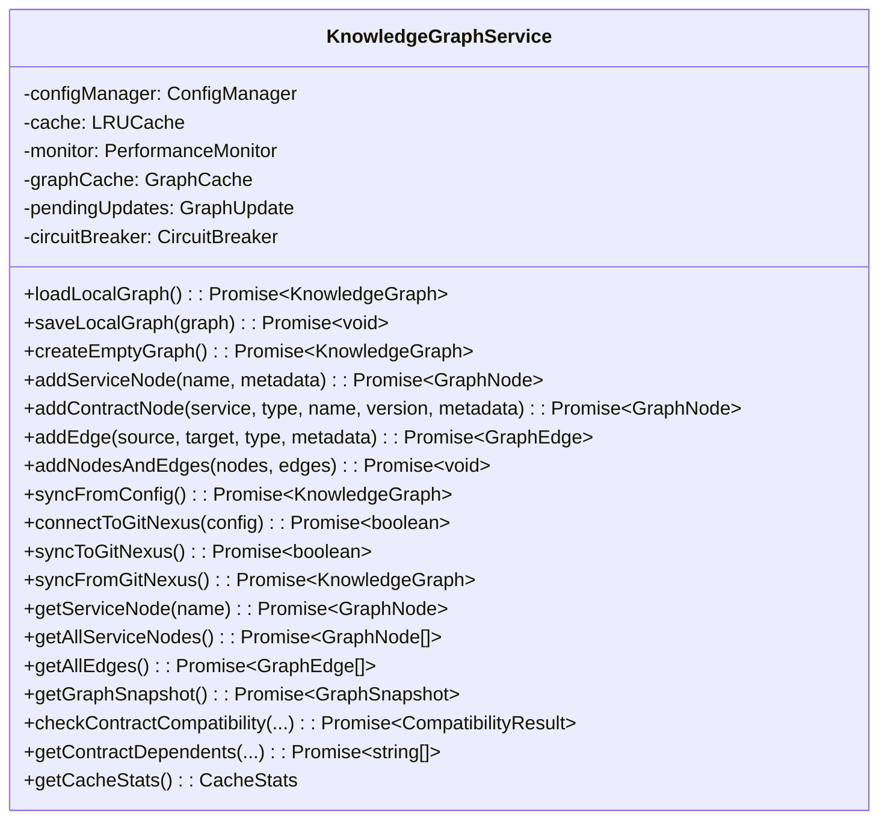
```mermaid
classDiagram
    class KnowledgeGraphService {
        -configManager: ConfigManager
        -cache: LRUCache
        -monitor: PerformanceMonitor
        -graphCache: GraphCache
        -pendingUpdates: GraphUpdate
        -circuitBreaker: CircuitBreaker
        +loadLocalGraph(): Promise~KnowledgeGraph~
        +saveLocalGraph(graph): Promise~void~
        +createEmptyGraph(): Promise~KnowledgeGraph~
        +addServiceNode(name, metadata): Promise~GraphNode~
        +addContractNode(service, type, name, version, metadata): Promise~GraphNode~
        +addEdge(source, target, type, metadata): Promise~GraphEdge~
        +addNodesAndEdges(nodes, edges): Promise~void~
        +syncFromConfig(): Promise~KnowledgeGraph~
        +connectToGitNexus(config): Promise~boolean~
        +syncToGitNexus(): Promise~boolean~
        +syncFromGitNexus(): Promise~KnowledgeGraph~
        +getServiceNode(name): Promise~GraphNode~
        +getAllServiceNodes(): Promise~GraphNode[]~
        +getAllEdges(): Promise~GraphEdge[]~
        +getGraphSnapshot(): Promise~GraphSnapshot~
        +checkContractCompatibility(...): Promise~CompatibilityResult~
        +getContractDependents(...): Promise~string[]~
        +getCacheStats(): CacheStats
    }
```

**图谱数据结构:**

```typescript
interface KnowledgeGraph {
  nodes: GraphNode[];
  edges: GraphEdge[];
  version: string;
  lastUpdated: string;
}

interface GraphNode {
  id: string;
  type: 'service' | 'api' | 'event' | 'contract' | 'data_type';
  name: string;
  metadata?: Record<string, any>;
}

interface GraphEdge {
  id: string;
  source: string;
  target: string;
  type: 'depends_on' | 'provides' | 'consumes' | 'references' | 'extends' | 'produces' | 'uses';
  metadata?: Record<string, any>;
}
```

### 3.7 兼容性验证器 (CompatibilityValidator)

**职责:** 验证契约变更的兼容性

**类图:**

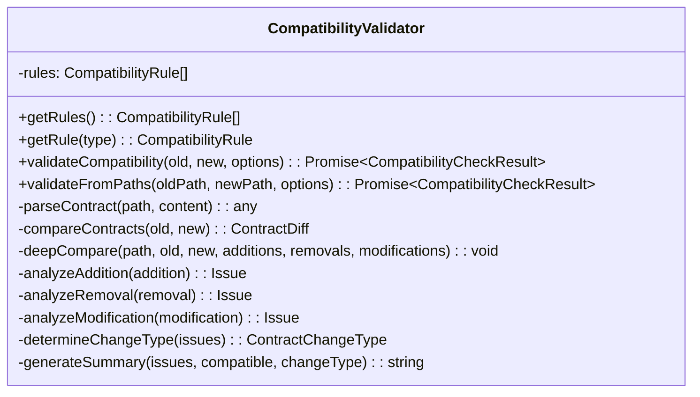
```mermaid
classDiagram
    class CompatibilityValidator {
        -rules: CompatibilityRule[]
        +getRules(): CompatibilityRule[]
        +getRule(type): CompatibilityRule
        +validateCompatibility(old, new, options): Promise~CompatibilityCheckResult~
        +validateFromPaths(oldPath, newPath, options): Promise~CompatibilityCheckResult~
        -parseContract(path, content): any
        -compareContracts(old, new): ContractDiff
        -deepCompare(path, old, new, additions, removals, modifications): void
        -analyzeAddition(addition): Issue
        -analyzeRemoval(removal): Issue
        -analyzeModification(modification): Issue
        -determineChangeType(issues): ContractChangeType
        -generateSummary(issues, compatible, changeType): string
    }
```

**兼容性规则:**

| 规则类型 | 向后兼容 | 破坏性 | 风险等级 | 可自动批准 |
|---------|---------|--------|---------|-----------|
| add_optional_field | ✅ | ❌ | low | ✅ |
| add_endpoint | ✅ | ❌ | low | ✅ |
| add_event | ✅ | ❌ | low | ✅ |
| deprecate_field | ✅ | ❌ | medium | ✅ |
| remove_field | ❌ | ✅ | high | ❌ |
| change_field_type | ❌ | ✅ | high | ❌ |
| change_endpoint_path | ❌ | ✅ | high | ❌ |
| add_required_field | ❌ | ✅ | critical | ❌ |
| remove_event | ❌ | ✅ | high | ❌ |
| change_event_schema | ❌ | ✅ | medium | ❌ |

### 3.8 CI/CD 集成 (CiCdIntegration)

**职责:** 与 CI/CD 系统集成，自动化契约验证

**类图:**

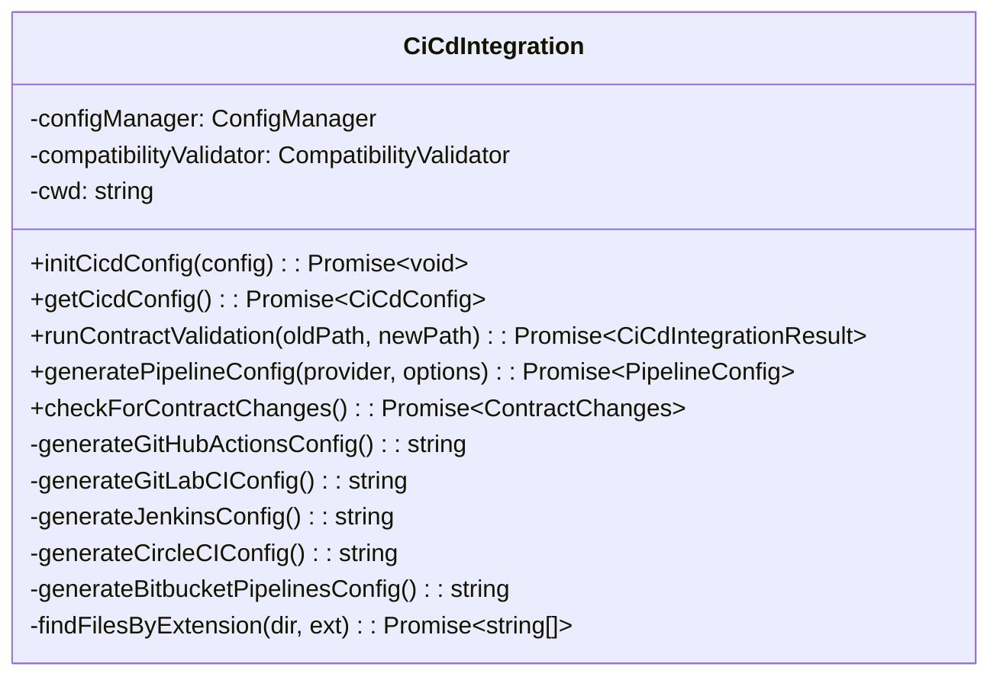
```mermaid
classDiagram
    class CiCdIntegration {
        -configManager: ConfigManager
        -compatibilityValidator: CompatibilityValidator
        -cwd: string
        +initCicdConfig(config): Promise~void~
        +getCicdConfig(): Promise~CiCdConfig~
        +runContractValidation(oldPath, newPath): Promise~CiCdIntegrationResult~
        +generatePipelineConfig(provider, options): Promise~PipelineConfig~
        +checkForContractChanges(): Promise~ContractChanges~
        -generateGitHubActionsConfig(): string
        -generateGitLabCIConfig(): string
        -generateJenkinsConfig(): string
        -generateCircleCIConfig(): string
        -generateBitbucketPipelinesConfig(): string
        -findFilesByExtension(dir, ext): Promise~string[]~
    }
```

**支持的 CI/CD 平台:**

- GitHub Actions
- GitLab CI
- Jenkins
- CircleCI
- Bitbucket Pipelines

### 3.9 部署管理器 (DeploymentManager)

**职责:** 管理契约的部署流程

**类图:**

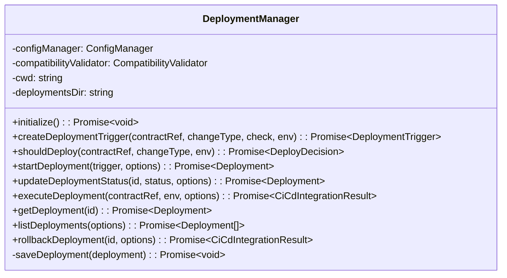
```mermaid
classDiagram
    class DeploymentManager {
        -configManager: ConfigManager
        -compatibilityValidator: CompatibilityValidator
        -cwd: string
        -deploymentsDir: string
        +initialize(): Promise~void~
        +createDeploymentTrigger(contractRef, changeType, check, env): Promise~DeploymentTrigger~
        +shouldDeploy(contractRef, changeType, env): Promise~DeployDecision~
        +startDeployment(trigger, options): Promise~Deployment~
        +updateDeploymentStatus(id, status, options): Promise~Deployment~
        +executeDeployment(contractRef, env, options): Promise~CiCdIntegrationResult~
        +getDeployment(id): Promise~Deployment~
        +listDeployments(options): Promise~Deployment[]~
        +rollbackDeployment(id, options): Promise~CiCdIntegrationResult~
        -saveDeployment(deployment): Promise~void~
    }
```

### 3.10 OpenSpec 集成 (OpenSpecIntegration)

**职责:** 与 OpenSpec 1.3 的深度集成

**类图:**

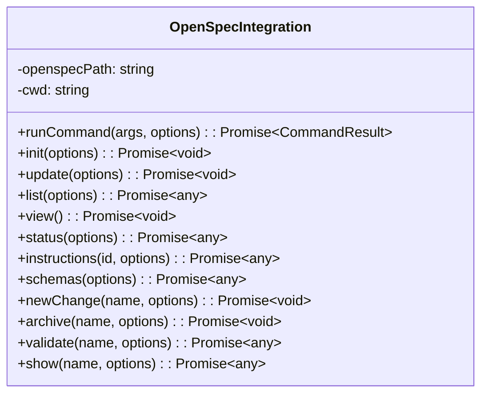
```mermaid
classDiagram
    class OpenSpecIntegration {
        -openspecPath: string
        -cwd: string
        +runCommand(args, options): Promise~CommandResult~
        +init(options): Promise~void~
        +update(options): Promise~void~
        +list(options): Promise~any~
        +view(): Promise~void~
        +status(options): Promise~any~
        +instructions(id, options): Promise~any~
        +schemas(options): Promise~any~
        +newChange(name, options): Promise~void~
        +archive(name, options): Promise~void~
        +validate(name, options): Promise~any~
        +show(name, options): Promise~any~
    }
```

---

## 4. 数据模型设计

### 4.1 核心类型定义

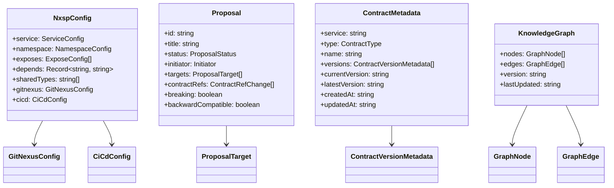
```mermaid
classDiagram
    class NxspConfig {
        +service: ServiceConfig
        +namespace: NamespaceConfig
        +exposes: ExposeConfig[]
        +depends: Record~string, string~
        +sharedTypes: string[]
        +gitnexus: GitNexusConfig
        +cicd: CiCdConfig
    }
    
    class Proposal {
        +id: string
        +title: string
        +status: ProposalStatus
        +initiator: Initiator
        +targets: ProposalTarget[]
        +contractRefs: ContractRefChange[]
        +breaking: boolean
        +backwardCompatible: boolean
    }
    
    class ContractMetadata {
        +service: string
        +type: ContractType
        +name: string
        +versions: ContractVersionMetadata[]
        +currentVersion: string
        +latestVersion: string
        +createdAt: string
        +updatedAt: string
    }
    
    class KnowledgeGraph {
        +nodes: GraphNode[]
        +edges: GraphEdge[]
        +version: string
        +lastUpdated: string
    }
    
    NxspConfig --> GitNexusConfig
    NxspConfig --> CiCdConfig
    Proposal --> ProposalTarget
    ContractMetadata --> ContractVersionMetadata
    KnowledgeGraph --> GraphNode
    KnowledgeGraph --> GraphEdge
```

### 4.2 枚举类型

```typescript
type ProposalStatus = 
  | 'draft' 
  | 'submitted' 
  | 'reviewing' 
  | 'accepted' 
  | 'rejected' 
  | 'counterproposed' 
  | 'implementing' 
  | 'completed' 
  | 'closed';

type ContractStatus = 
  | 'draft' 
  | 'active' 
  | 'deprecated' 
  | 'retired';

type ContractChangeType = 
  | 'breaking' 
  | 'compatible' 
  | 'patch' 
  | 'minor' 
  | 'major';

type CiCdProvider = 
  | 'github_actions' 
  | 'gitlab_ci' 
  | 'jenkins' 
  | 'circleci' 
  | 'bitbucket_pipelines' 
  | 'custom';

type DeploymentStatus = 
  | 'pending' 
  | 'running' 
  | 'success' 
  | 'failed' 
  | 'cancelled' 
  | 'skipped';

type ReviewSuggestionType = 
  | 'auto_approve' 
  | 'approve_with_warning' 
  | 'needs_manual_review' 
  | 'reject' 
  | 'suggest_counterproposal';
```

### 4.3 契约引用格式

```
contract://{service}/{type}/{name}:{version}
```

**示例:**
- `contract://user-service/api/default:v1`
- `contract://payment-service/events/transactions:v2`

---

## 5. CLI 命令设计

### 5.1 命令架构

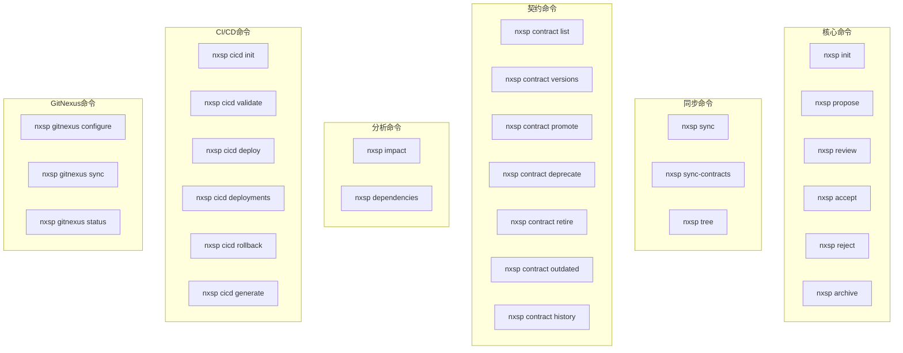
```mermaid
graph TB
    subgraph 核心命令
        init[nxsp init]
        propose[nxsp propose]
        review[nxsp review]
        accept[nxsp accept]
        reject[nxsp reject]
        archive[nxsp archive]
    end
    
    subgraph 同步命令
        sync[nxsp sync]
        sync_contracts[nxsp sync-contracts]
        tree[nxsp tree]
    end
    
    subgraph 契约命令
        contract_list[nxsp contract list]
        contract_versions[nxsp contract versions]
        contract_promote[nxsp contract promote]
        contract_deprecate[nxsp contract deprecate]
        contract_retire[nxsp contract retire]
        contract_outdated[nxsp contract outdated]
        contract_history[nxsp contract history]
    end
    
    subgraph 分析命令
        impact[nxsp impact]
        dependencies[nxsp dependencies]
    end
    
    subgraph CI/CD命令
        cicd_init[nxsp cicd init]
        cicd_validate[nxsp cicd validate]
        cicd_deploy[nxsp cicd deploy]
        cicd_deployments[nxsp cicd deployments]
        cicd_rollback[nxsp cicd rollback]
        cicd_generate[nxsp cicd generate]
    end
    
    subgraph GitNexus命令
        gn_configure[nxsp gitnexus configure]
        gn_sync[nxsp gitnexus sync]
        gn_status[nxsp gitnexus status]
    end
```

### 5.2 命令详细说明

| 命令 | 描述 | 主要参数 |
|------|------|---------|
| `nxsp init` | 初始化 NexusSpec | `--namespace`, `--service`, `--team` |
| `nxsp propose` | 创建跨服务提案 | `--title`, `--target`, `--contract-type`, `--breaking` |
| `nxsp review` | 审查提案 | `--id`, `--auto` |
| `nxsp accept` | 接受提案 | `<id>` |
| `nxsp reject` | 拒绝提案 | `<id>` |
| `nxsp archive` | 归档提案/变更 | `[id]`, `--yes`, `--skip-specs` |
| `nxsp impact` | 影响分析 | `--service`, `--contract`, `--breaking` |
| `nxsp contract promote` | 提升契约版本 | `<service> <type> <name> <version>` |
| `nxsp contract deprecate` | 废弃契约版本 | `<service> <type> <name> <version>` |
| `nxsp contract retire` | 下线契约版本 | `<service> <type> <name> <version>` |
| `nxsp cicd validate` | 验证契约兼容性 | `--old`, `--new`, `--all` |
| `nxsp cicd deploy` | 部署契约 | `--environment`, `--contract` |

---

## 6. 工作流程设计

### 6.1 提案创建流程

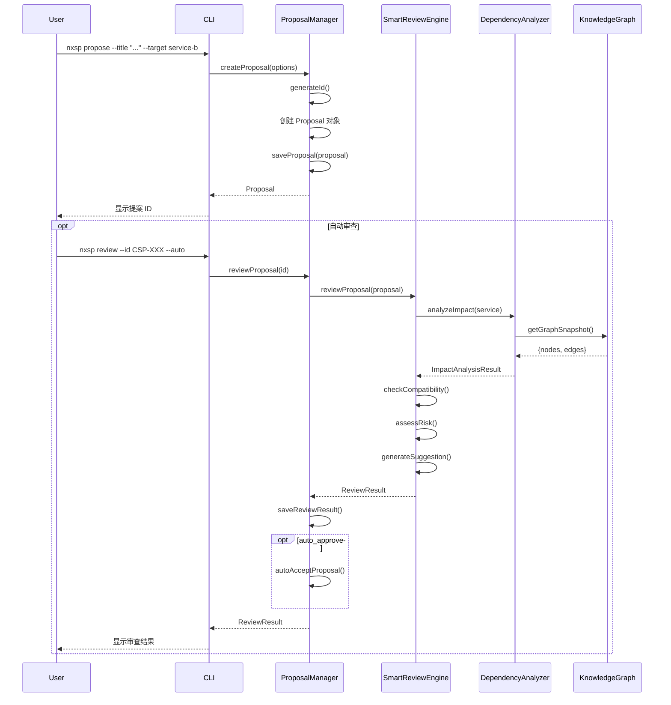
```mermaid
sequenceDiagram
    participant User
    participant CLI
    participant PM as ProposalManager
    participant SRE as SmartReviewEngine
    participant DA as DependencyAnalyzer
    participant KG as KnowledgeGraph
    
    User->>CLI: nxsp propose --title "..." --target service-b
    CLI->>PM: createProposal(options)
    PM->>PM: generateId()
    PM->>PM: 创建 Proposal 对象
    PM->>PM: saveProposal(proposal)
    PM-->>CLI: Proposal
    CLI-->>User: 显示提案 ID
    
    opt 自动审查
        User->>CLI: nxsp review --id CSP-XXX --auto
        CLI->>PM: reviewProposal(id)
        PM->>SRE: reviewProposal(proposal)
        SRE->>DA: analyzeImpact(service)
        DA->>KG: getGraphSnapshot()
        KG-->>DA: {nodes, edges}
        DA-->>SRE: ImpactAnalysisResult
        SRE->>SRE: checkCompatibility()
        SRE->>SRE: assessRisk()
        SRE->>SRE: generateSuggestion()
        SRE-->>PM: ReviewResult
        PM->>PM: saveReviewResult()
        opt auto_approve
            PM->>PM: autoAcceptProposal()
        end
        PM-->>CLI: ReviewResult
        CLI-->>User: 显示审查结果
    end
```

### 6.2 契约版本提升流程

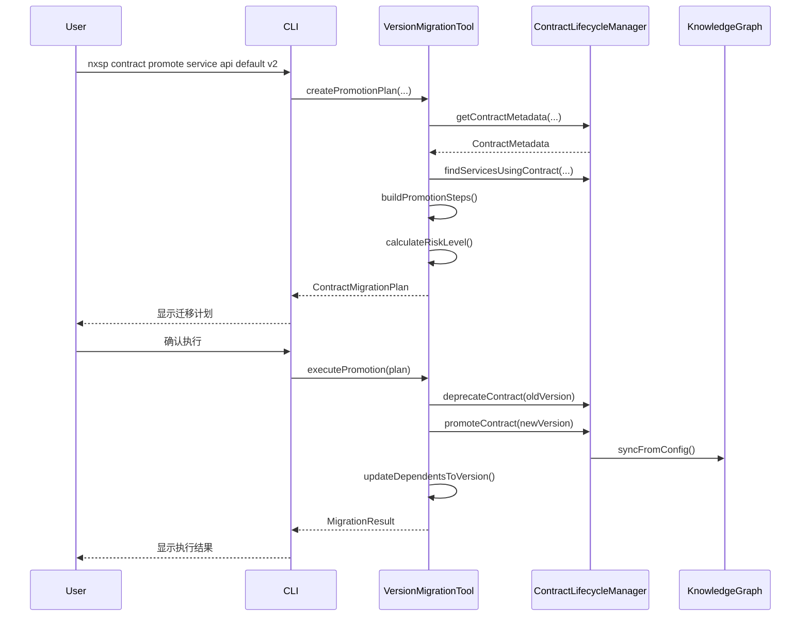
```mermaid
sequenceDiagram
    participant User
    participant CLI
    participant VMT as VersionMigrationTool
    participant CLM as ContractLifecycleManager
    participant KG as KnowledgeGraph
    
    User->>CLI: nxsp contract promote service api default v2
    CLI->>VMT: createPromotionPlan(...)
    VMT->>CLM: getContractMetadata(...)
    CLM-->>VMT: ContractMetadata
    VMT->>CLM: findServicesUsingContract(...)
    VMT->>VMT: buildPromotionSteps()
    VMT->>VMT: calculateRiskLevel()
    VMT-->>CLI: ContractMigrationPlan
    CLI-->>User: 显示迁移计划
    
    User->>CLI: 确认执行
    CLI->>VMT: executePromotion(plan)
    VMT->>CLM: deprecateContract(oldVersion)
    VMT->>CLM: promoteContract(newVersion)
    CLM->>KG: syncFromConfig()
    VMT->>VMT: updateDependentsToVersion()
    VMT-->>CLI: MigrationResult
    CLI-->>User: 显示执行结果
```

### 6.3 CI/CD 集成流程

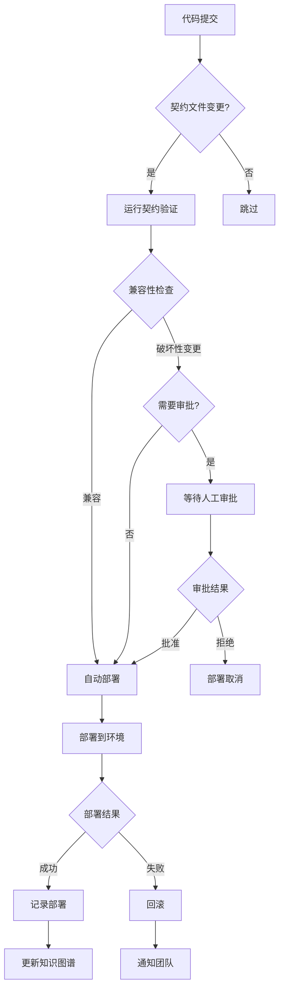
```mermaid
flowchart TB
    A[代码提交] --> B{契约文件变更?}
    B -->|是| C[运行契约验证]
    B -->|否| D[跳过]
    
    C --> E{兼容性检查}
    E -->|兼容| F[自动部署]
    E -->|破坏性变更| G{需要审批?}
    
    G -->|是| H[等待人工审批]
    G -->|否| F
    
    H --> I{审批结果}
    I -->|批准| F
    I -->|拒绝| J[部署取消]
    
    F --> K[部署到环境]
    K --> L{部署结果}
    L -->|成功| M[记录部署]
    L -->|失败| N[回滚]
    
    N --> O[通知团队]
    M --> P[更新知识图谱]
```

---

## 7. 性能与可靠性设计

### 7.1 缓存机制

**LRU 缓存实现:**

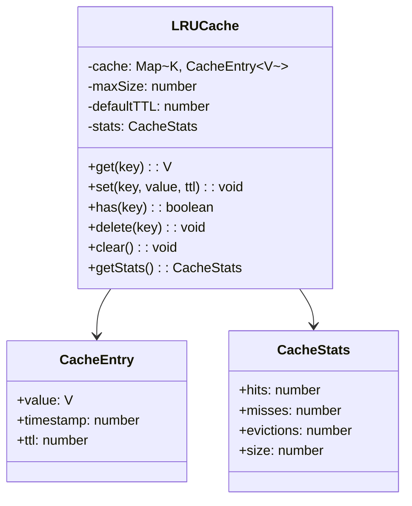
```mermaid
classDiagram
    class LRUCache {
        -cache: Map~K, CacheEntry~V~~
        -maxSize: number
        -defaultTTL: number
        -stats: CacheStats
        +get(key): V
        +set(key, value, ttl): void
        +has(key): boolean
        +delete(key): void
        +clear(): void
        +getStats(): CacheStats
    }
    
    class CacheEntry {
        +value: V
        +timestamp: number
        +ttl: number
    }
    
    class CacheStats {
        +hits: number
        +misses: number
        +evictions: number
        +size: number
    }
    
    LRUCache --> CacheEntry
    LRUCache --> CacheStats
```

**缓存策略:**

| 缓存类型 | 最大容量 | TTL | 用途 |
|---------|---------|-----|------|
| 图谱缓存 | 1000 条 | 5 分钟 | 知识图谱节点/边 |
| 索引缓存 | 100 条 | 5 分钟 | 图谱索引 |
| 分析结果缓存 | 100 条 | 30 秒 | 影响分析结果 |

### 7.2 弹性设计

**熔断器模式:**

```mermaid
stateDiagram-v2
    [*] --> closed: 初始状态
    closed --> open: 失败次数超过阈值
    open --> half_open: 重置超时后
    half_open --> closed: 成功次数达标
    half_open --> open: 再次失败
    
    state closed {
        [*] --> 正常执行
        正常执行 --> [*]
    }
    
    state open {
        [*] --> 快速失败
        快速失败 --> [*]
    }
    
    state half_open {
        [*] --> 尝试执行
        尝试执行 --> [*]
    }
```

**重试机制:**

```typescript
interface RetryOptions {
  maxAttempts: number;      // 最大重试次数，默认 3
  initialDelay: number;     // 初始延迟，默认 1000ms
  maxDelay: number;         // 最大延迟，默认 30000ms
  backoffMultiplier: number; // 退避乘数，默认 2
  retryOn: (error: Error) => boolean;
  onRetry: (attempt: number, error: Error, delay: number) => void;
}
```

**限流器:**

```typescript
interface RateLimiterOptions {
  limit: number;  // 窗口内最大请求数
  window: number; // 时间窗口 (ms)
}
```

**舱壁模式:**

```typescript
interface BulkheadOptions {
  maxConcurrent: number;  // 最大并发数，默认 10
  maxQueueSize: number;   // 最大队列大小，默认 100
  timeout: number;        // 超时时间，默认 30000ms
}
```

### 7.3 性能监控

```mermaid
classDiagram
    class PerformanceMonitor {
        -metrics: Map~string, number[]~
        -counters: Map~string, number~
        -startTimes: Map~string, number~
        +startTimer(key): void
        +endTimer(key): number
        +recordMetric(key, value): void
        +incrementCounter(key, amount): void
        +getMetrics(key): MetricsResult
        +getCounter(key): number
        +getAllMetrics(): Record~string, MetricsResult~
        +getAllCounters(): Record~string, number~
        +reset(): void
    }
    
    class MetricsResult {
        +count: number
        +sum: number
        +avg: number
        +min: number
        +max: number
        +p50: number
        +p95: number
        +p99: number
    }
    
    PerformanceMonitor --> MetricsResult
```

**监控指标:**

| 指标名称 | 描述 |
|---------|------|
| `knowledgeGraph.load` | 图谱加载时间 |
| `knowledgeGraph.save` | 图谱保存时间 |
| `knowledgeGraph.syncFromConfig` | 配置同步时间 |
| `knowledgeGraph.flush` | 批量更新刷新时间 |
| `dependencyAnalyzer.analyzeImpact` | 影响分析时间 |
| `dependencyAnalyzer.getFullDependencyMap` | 依赖图获取时间 |

---

## 8. UI 组件设计

### 8.1 组件架构

```mermaid
graph TB
    subgraph App
        Nav[导航栏]
        Sidebar[侧边栏]
        Content[内容区]
    end
    
    subgraph 视图组件
        STV[SpecTreeView]
        DG[DependencyGraph]
        CSP[CSPFlowView]
    end
    
    subgraph 可视化组件
        RF[ReactFlow]
        Tree[树状渲染]
        Graph[图谱渲染]
    end
    
    Content --> STV
    Content --> DG
    Content --> CSP
    
    STV --> Tree
    DG --> Graph
    CSP --> RF
```

### 8.2 视图类型

| 视图 | 组件 | 描述 |
|------|------|------|
| 树状结构 | `SpecTreeView` | 显示命名空间的树状规范结构 |
| 依赖关系 | `DependencyGraph` | 显示服务间的依赖关系图谱 |
| CSP 流程 | `CSPFlowView` | 显示跨服务提案的工作流程 |

### 8.3 技术实现

- **React 19** - UI 框架
- **ReactFlow 11** - 流程图可视化
- **TailwindCSS 3** - 样式系统
- **Lucide React** - 图标库

---

## 9. 扩展机制

### 9.1 自定义审查策略

在 `spec/policies/review-policies.yaml` 中定义:

```yaml
autoAccept:
  rules:
    - match:
        contractAction: new-contract-version
        backwardCompatible: true
      action: auto-accept
      
    - match:
        contractAction: deprecate-field
        riskLevel: low
      action: approve-with-warning
```

### 9.2 自定义 CI/CD 提供商

实现 `CiCdProvider` 接口:

```typescript
interface CustomCiCdProvider {
  name: string;
  generateConfig(options: PipelineOptions): string;
  validateConfig(config: string): boolean;
}
```

### 9.3 自定义知识图谱集成

扩展 `KnowledgeGraphService`:

```typescript
class CustomGraphIntegration extends KnowledgeGraphService {
  async connectToCustomGraph(config: CustomConfig): Promise<boolean>;
  async syncToCustomGraph(): Promise<boolean>;
  async syncFromCustomGraph(): Promise<KnowledgeGraph>;
}
```

### 9.4 OpenSpec 钩子

利用 OpenSpec 的钩子系统:

```yaml
# openspec/config.yaml
hooks:
  preArchive:
    - "nxsp sync-contracts"
  postChange:
    - "nxsp impact --service ${service}"
```

---

## 附录

### A. 配置示例

**.nxsp/config.yaml:**

```yaml
service:
  name: payment-service
  team: payments-team

namespace:
  remote: git@github.com:your-org/payments-namespace.git
  localPath: ~/.nxsp/namespaces/payments-namespace

exposes:
  - type: api
    path: src/api/openapi.yaml
    name: default
  - type: events
    path: src/events/schemas/
    name: default

depends:
  user-api: contract://user-service/api/default:v1
  notification-events: contract://notification-service/events/default:v1

sharedTypes:
  - common-types
  - error-codes

cicd:
  enabled: true
  provider: github_actions
  contractValidation:
    enabled: true
    strict: false
    failOnBreakingChanges: true
  deployment:
    enabled: true
    autoDeployCompatibleChanges: true
    autoDeployPatchChanges: true
    requireApprovalForBreakingChanges: true
```

### B. 契约元数据示例

**contracts/payment-service/api/default-metadata.yaml:**

```yaml
service: payment-service
type: api
name: default
versions:
  - version: v1
    status: deprecated
    createdAt: '2025-01-01T00:00:00Z'
    updatedAt: '2025-06-01T00:00:00Z'
    deprecatedAt: '2025-06-01T00:00:00Z'
    description: Initial API version
    backwardCompatible: true
    migrationGuide: Please migrate to v2
  - version: v2
    status: active
    createdAt: '2025-06-01T00:00:00Z'
    updatedAt: '2025-06-01T00:00:00Z'
    description: Added refund endpoint
    backwardCompatible: true
currentVersion: v2
latestVersion: v2
createdAt: '2025-01-01T00:00:00Z'
updatedAt: '2025-06-01T00:00:00Z'
```

### C. 提案示例

**proposals/active/CSP-ABC123/proposal.yaml:**

```yaml
id: CSP-ABC123
title: Add refund endpoint to payment API
status: reviewing
initiator:
  service: order-service
  agent: nxsp-cli
  createdAt: '2025-06-15T10:00:00Z'
targets:
  - service: payment-service
    requiredAction: new_contract_version
    contract:
      type: api
      name: default
      currentVersion: v2
      proposedVersion: v3
      change: add_endpoint
      detail: Add POST /refund endpoint
    urgency: normal
    reviewStatus: pending
breaking: false
backwardCompatible: true
```

---

*文档版本: 2.0.0 | 最后更新: 2026-04-29*
